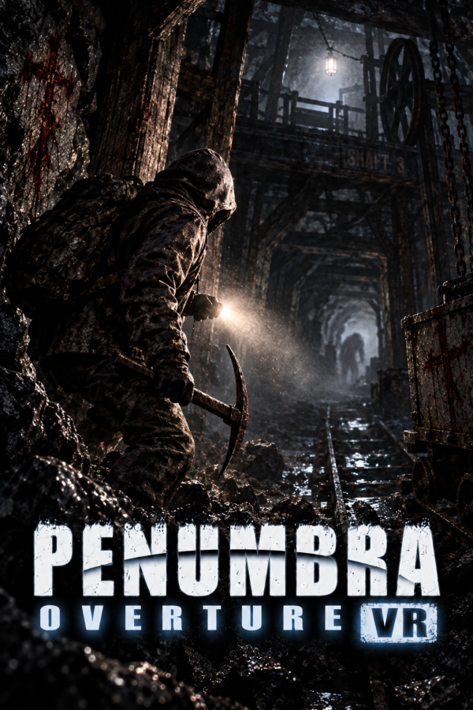
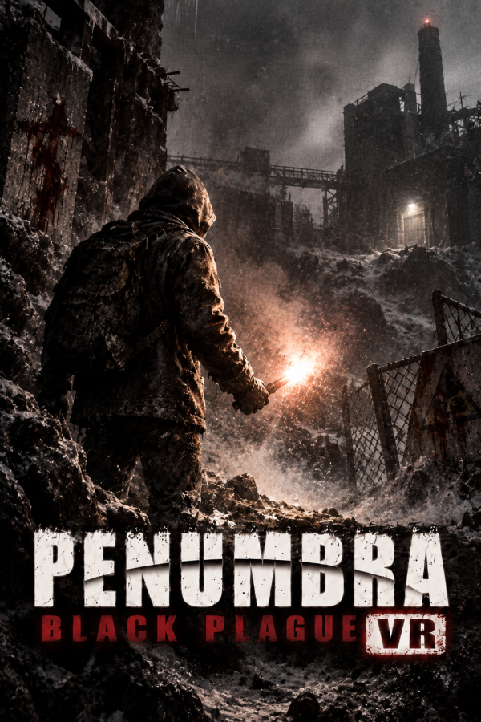
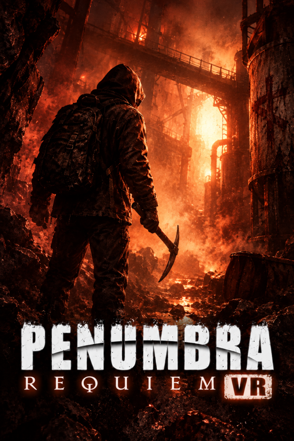

# Penumbra VR Framework

<p align="center">
  <a href="COPYING"></a>
  
  
  
</p>
<p align="center">
  <a href="https://ko-fi.com/onitaku"></a>
</p>

**One PCVR framework for Penumbra: Overture, Black Plague and Requiem.**

The project turns the proven Overture VR Rework into a shared runtime, keeping reusable VR systems common while renderer, physics, gameplay and exact-build behavior remain inside each game's backend.

> **Pre-alpha — no public Framework release yet.** Overture is integrated as the proven baseline. Black Plague is the active second backend and already runs in tracked stereo from Steam's normal **Play** path on the allowlisted build. Requiem is the next planned gameplay backend.

<p align="center">
  
  
  
</p>

## Current state

| Game | Framework state |
| --- | --- |
| **Overture** | Integrated Framework-owned source product. The proven VR Rework remains the behavioral reference and has an initial Framework headset regression pass. |
| **Black Plague** | Active backend with native tracked stereo, OpenVR input, room-scale/body integration, crouch, hands, physical interaction, tracked inventory/notebook input, native VR settings and reusable audio integration. Current work is focused on remaining interaction, comfort, presentation and headset-validation gaps. |
| **Requiem** | Build identity, LAA transform metadata, localization and shared configuration data are prepared. Gameplay VR implementation has not started. |

The shared runtime provides the common tracking, locomotion, input, interaction, haptics, rendering policy and calibration systems. Each backend owns the game-specific integration needed to make those systems behave correctly in that title.

For a finished Overture package today, use [Penumbra: Overture VR Rework](https://github.com/rubocopter/penumbra_vr_rework).

## Documentation

[Roadmap](ROADMAP.md) ·
[Architecture](ARCHITECTURE.md) ·
[Trilogy parity](docs/TRILOGY_PARITY_PLAN.md) ·
[Supported builds](docs/SUPPORTED_BUILDS.md) ·
[VR configuration](docs/VR_CONFIGURATION.md) ·
[Headset validation](docs/VR_HEADSET_TEST_CHECKLIST.md) ·
[Installer design](docs/INSTALLER_DESIGN.md)

The README is intentionally a Framework landing page. Detailed contracts, validation evidence and engineering decisions live in the versioned documentation; temporary captures, disassemblies, debugging notes and agent handoffs remain outside the public-facing project overview.

<details>
<summary><strong>Development</strong></summary>

Native targets are Windows/x86. Development requires Visual Studio 2022 with C++ support and CMake 3.25+.

```powershell
cmake --preset vs2022-win32
cmake --build --preset release
ctest --preset release --output-on-failure
```

Engineering rules and implementation contracts are documented in [AGENTS.md](AGENTS.md), [design decisions](docs/DESIGN_DECISIONS.md) and the [Rework porting contract](docs/REWORK_PORTING_PLAN.md).

</details>

## License

Penumbra VR Framework is an unofficial community project and is not affiliated with or endorsed by Frictional Games, Valve or Sony Interactive Entertainment.

Licensed under **GNU GPL v3 or later**; see [COPYING](COPYING) and [THIRD_PARTY.md](THIRD_PARTY.md).
