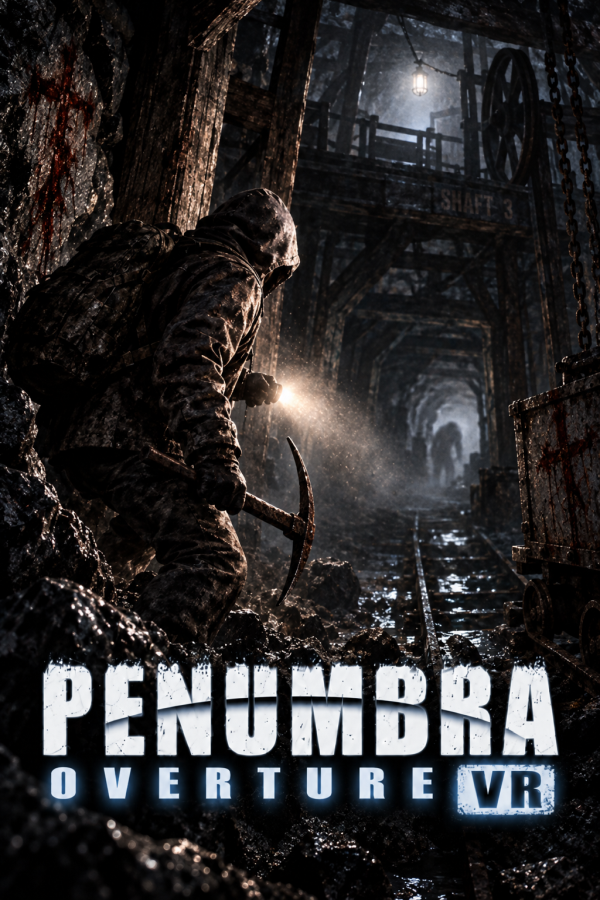
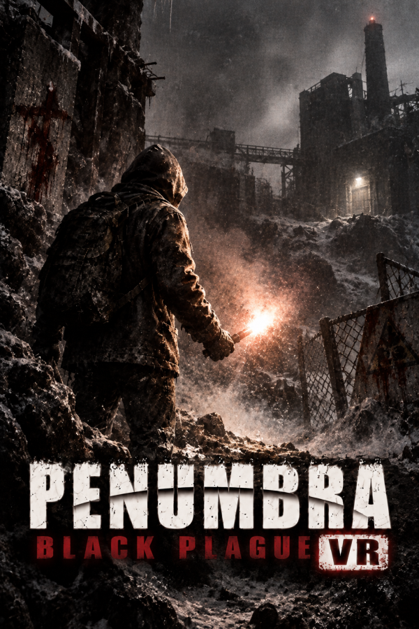

  

  
  
  
  

  

  <b>Bring the complete Penumbra trilogy into PC VR.</b> 
  Stereoscopic rendering, head tracking, tracked hands, motion-controller interaction, 
  room-scale movement and VR-ready menus — delivered through one installer.

  <a href="https://github.com/rubocopter/penumbra_vr_framework/releases/latest"><b>Download the VR installer →</b></a>
  &nbsp;·&nbsp;
  <a href="#install">Install</a>
  &nbsp;·&nbsp;
  <a href="docs/CONTROLS.md">Controls</a>
  &nbsp;·&nbsp;
  <a href="docs/TROUBLESHOOTING.md">Troubleshooting</a>

> [!IMPORTANT]
> You need the original PC games and SteamVR. Install only the games you own. **Penumbra: Requiem is an expansion and requires Penumbra: Black Plague.**

## One framework, three games

<table>
<tr>
<td width="33%" align="center">
   
  <b>Penumbra: Overture</b> 
  Descend into the mine with full head tracking and tracked-hand interaction.
</td>
<td width="33%" align="center">
   
  <b>Penumbra: Black Plague</b> 
  Explore the shelter, handle objects directly and work through its puzzles in VR.
</td>
<td width="33%" align="center">
   
  <b>Penumbra: Requiem</b> 
  Return for the puzzle-focused expansion, running through the Black Plague installation.
</td>
</tr>
</table>

## What changes in VR

- **Look around naturally.** Head tracking and stereoscopic 3D place the original environments around you instead of on a flat screen.
- **Use tracked hands.** Reach for doors, drawers, switches, physics objects and other game interactions with motion controllers.
- **Move the way you prefer.** Controller locomotion, room-scale movement, turning and comfort options are available through the VR configuration.
- **Keep the game usable in-headset.** Inventory, notebook, menus and game-specific interfaces are adapted for VR.
- **Manage everything from one installer.** Detect supported games, install only the modules you own, apply optional extras, update, repair, collect diagnostics or remove the VR components.

The exact interaction set varies between the three games. See the [controls guide](docs/CONTROLS.md) and [trilogy capability notes](docs/TRILOGY_PARITY_PLAN.md) for the detailed breakdown.

## See it in motion

### Penumbra: Overture

https://github.com/user-attachments/assets/f842a62c-ed82-4423-b9b9-43c14caf2265

  <a href="https://www.youtube.com/watch?v=dc90jlH-tp0">Watch the first 18 minutes of Overture in VR →</a>

### Penumbra: Black Plague

https://github.com/user-attachments/assets/9e4cc11f-7785-42e6-be19-6fa0ced367fd

### Penumbra: Requiem

https://github.com/user-attachments/assets/3e87feb8-b50b-484d-b283-57c84128a2b3

## Install

1. Install **Penumbra: Overture**, **Penumbra: Black Plague** and/or **Penumbra: Requiem**, plus SteamVR.
2. Download and run the [latest Penumbra VR installer](https://github.com/rubocopter/penumbra_vr_framework/releases/latest). It detects supported installations and lets you choose the games and optional components you want.
3. Start SteamVR, put on the headset and launch the game normally.

The installer can also update, verify, repair or remove the Framework. Optional components include Spanish translations, Overture texture improvements and recommended graphics settings.

## Requirements and compatibility

**Required:** Windows PC · SteamVR · PCVR headset · two tracked controllers · original supported Penumbra game files.

The Framework has been tested end-to-end primarily with **PS VR2 and Sense controllers**. Bundled profiles are also provided for Valve Index, Meta/Oculus Touch, Pico, Vive and Windows Mixed Reality controllers, but not every device/action combination has been validated on physical hardware.

Unknown or modified game builds may be rejected by the installer. Check [supported builds](docs/SUPPORTED_BUILDS.md), [controller mappings](docs/CONTROLS.md) and the [VR configuration guide](docs/VR_CONFIGURATION.md) before troubleshooting a setup.

## Current release status

The current public release is **[v1.0.6](https://github.com/rubocopter/penumbra_vr_framework/releases/tag/v1.0.6)**.

VR Settings now appears in the same first-level position in the main and pause menus of all three games, in English and Spanish. This release includes maintainer-accepted Black Plague vice/locker and Requiem intro-height feedback fixes, plus a correction for excessive Black Plague blocking near movable obstacles. The new menu routes and mixed-obstacle correction have host tests; their headset confirmation remains separate.

Known issues include intermittent Requiem startup failure and a reported finger-pose mismatch. Full progression, the new menu/obstacle changes and other controller families still need broader device validation. See [release status and validation](docs/CLOSURE_STATUS.md) for the current ledger.

## Help and documentation

| Playing and setup | Project and technical |
| --- | --- |
| [Controls](docs/CONTROLS.md) | [Architecture](docs/ARCHITECTURE.md) |
| [VR configuration](docs/VR_CONFIGURATION.md) | [Trilogy capabilities](docs/TRILOGY_PARITY_PLAN.md) |
| [Troubleshooting](docs/TROUBLESHOOTING.md) | [Supported builds](docs/SUPPORTED_BUILDS.md) |
| [Release notes](docs/releases/1.0.6.md) | [Roadmap](docs/ROADMAP.md) |
| [Known issues / validation](docs/CLOSURE_STATUS.md) | [Build and source notes](docs/SOURCE-AND-NOTICES.md) |

If something breaks, check [Troubleshooting](docs/TROUBLESHOOTING.md) first. For a new bug, [open a GitHub issue](https://github.com/rubocopter/penumbra_vr_framework/issues) and include the game, Framework version, headset/controllers, steps to reproduce and relevant logs.

<b>Controller notes</b>

Bindings are included for PS VR2 Sense, Valve Index, Meta/Oculus Touch, Pico, Vive and Windows Mixed Reality controllers. A bundled profile does not mean every action has been validated on physical hardware.

With the default right-handed Sense layout, the left stick moves and the right stick turns. R2 interacts or uses an item, R1 opens inventory, Square opens the notebook, Cross jumps and R3 toggles crouch in Button/Hybrid mode. Bindings can be changed in SteamVR.

See [Controls](docs/CONTROLS.md) and the [controller capability ledger](docs/TRILOGY_PARITY_PLAN.md#controller-profiles-and-distribution).

<b>Installer, repair and removal</b>

The installer lets you choose individual games and optional components, locate games that were not detected automatically, apply recommended settings, verify or repair an installation, create a diagnostics ZIP and uninstall VR components.

Overture is managed separately. Black Plague and Requiem share an installation folder, and Requiem depends on Black Plague. Reopen the same installer whenever you want to change or repair the selection.

See the [installer design and behaviour notes](docs/INSTALLER_DESIGN.md) and [recovery instructions](docs/TROUBLESHOOTING.md#repair-recovery-and-removal).

---

Penumbra VR Framework is an unofficial fan project and is not affiliated with or endorsed by Frictional Games, Valve or Sony Interactive Entertainment. The original games are required and are not included.

Licensed under **GNU GPL v3 or later**. See [COPYING](COPYING) and [third-party notices](docs/THIRD_PARTY.md).
