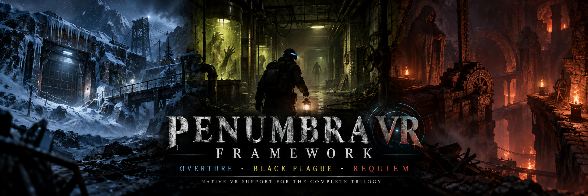

# Penumbra VR Framework

  
  
  

**Step into the complete Penumbra trilogy in PC VR.** Explore, solve puzzles and interact with the world using your headset and motion controllers.

[**Get the VR installer**](https://github.com/rubocopter/penumbra_vr_framework/releases/download/v1.0.5/PenumbraVR-Setup-1.0.5.exe) · [What you need](#before-you-start) · [Help](#need-help)

You’ll need the original PC games and SteamVR. Install only the games you own; **Requiem requires Penumbra: Black Plague**.

## Watch the trilogy in VR

### Penumbra: Overture

Explore the mine with head-tracked viewing, room-scale movement and hands-on interactions.

https://github.com/user-attachments/assets/f842a62c-ed82-4423-b9b9-43c14caf2265

[Watch the first 18 minutes, uncut, on YouTube](https://www.youtube.com/watch?v=dc90jlH-tp0)

### Penumbra: Black Plague

Investigate and solve puzzles with VR movement, tracked hands and physical object interaction.

https://github.com/user-attachments/assets/9e4cc11f-7785-42e6-be19-6fa0ced367fd

### Penumbra: Requiem

Play the expansion in VR on top of your Black Plague installation.

https://github.com/user-attachments/assets/325b79e0-aca3-4111-93d2-8a73f9530a07

The framework adds stereoscopic VR, controller-based movement and turning, object and puzzle interaction, and VR-friendly menus, inventory and notebook views. What’s available and tested varies by game and controller.

## Get started

1. Install the original game or games and SteamVR.
2. Download and run the [latest installer](https://github.com/rubocopter/penumbra_vr_framework/releases/tag/v1.0.5). Choose the games and optional extras you want.
3. Start SteamVR, put on your headset, then launch the game from Steam as usual.

The installer detects supported games and can install, update, repair or remove VR components. You don’t need to own the whole trilogy. Optional extras include Spanish translations, Overture texture improvements and recommended graphics settings.

## Before you start

- A Windows PC, a PCVR headset, two tracked controllers and SteamVR.
- Original game files matching a [recognized game build](docs/SUPPORTED_BUILDS.md). Other editions or modified executables may not work.
- Requiem installed as an expansion alongside Black Plague.

The project’s end-to-end headset testing has primarily used PS VR2 and Sense controllers. Other controller profiles are included, but their bindings and gameplay still need device-specific testing. Check the [controller guide](docs/CONTROLS.md) for details.

## Current notes

The latest release, **v1.0.5**, brings together the improvements made since v1.0.0. Overture gameplay and the Black Plague tutorial have been exercised by the maintainer; Requiem has had representative gameplay testing, but its full progression and startup reliability need more testing. Requiem may occasionally fail during startup, and contact with some Black Plague objects can push the player back more than intended. See [known issues and validation status](docs/CLOSURE_STATUS.md) before installing.

## Need help?

For installation steps, controller mappings, graphics settings and fixes, see [Troubleshooting](docs/TROUBLESHOOTING.md), [Controls](docs/CONTROLS.md) and [VR configuration](docs/VR_CONFIGURATION.md). To report a problem, [open or check a GitHub issue](https://github.com/rubocopter/penumbra_vr_framework/issues) and include the game, headset/controllers and what happened.

[Release notes](docs/releases/1.0.5.md) · [All releases](https://github.com/rubocopter/penumbra_vr_framework/releases) · [Support development on Ko-fi](https://ko-fi.com/onitaku)

Controller compatibility and default controls

Bindings are included for PS VR2 Sense, Valve Index, Meta/Oculus Touch, Pico and Windows Mixed Reality controllers. A profile being included does not mean that every controller or action has been validated on physical hardware. Vive wand and WMR layouts have known missing actions; see the [controller capability ledger](docs/TRILOGY_PARITY_PLAN.md#controller-profiles-and-distribution).

With the default right-handed Sense layout, the left stick moves and the right stick turns. R2 interacts or uses an item, R1 opens inventory, Square opens the notebook, Cross jumps and R3 toggles crouch in Button/Hybrid mode. Mappings can be changed in SteamVR.

Installer options, repair and removal

The installer lets you choose individual games and optional components, locate games that were not detected, apply recommended settings, verify or repair an installation, create a diagnostics ZIP and uninstall VR components. Overture is managed separately; Black Plague and Requiem share an installation folder, and Requiem depends on Black Plague. The same installer can be reopened to change or repair your selection.

See the [installer guide](docs/INSTALLER_DESIGN.md) and [recovery instructions](docs/TROUBLESHOOTING.md#repair-recovery-and-removal) for details.

Compatibility, settings and troubleshooting

Use recognized, clean game files and start SteamVR before launching a game. A GPU with working OpenGL drivers is required. The project has no published minimum CPU or GPU specification; performance depends on the PC, headset and selected render scale.

For a starting point, use VR render scale 1.0 where available and lower it if performance is insufficient. Disable desktop VSync/FPS limiting, legacy FSAA, motion blur, depth of field and noise filtering; keep physics at 60 updates per second. Keep PostEffects and Refractions enabled for Black Plague/Requiem. Settings vary between games; the [full configuration guide](docs/VR_CONFIGURATION.md) has the current recommendations.

Requiem can occasionally fail during startup. Black Plague may push the player back on contact with some objects. Other translations, texture packs, executable replacements and graphics injectors are not established as compatible. Unknown game builds are rejected by the installer.

If installation or launch fails, use the installer’s verify/repair tools and follow [Troubleshooting](docs/TROUBLESHOOTING.md). Include the game version, Framework release, headset/controllers, steps to reproduce and relevant logs in a [bug report](https://github.com/rubocopter/penumbra_vr_framework/issues).

More project information

For contributors and technical readers: [Architecture](docs/ARCHITECTURE.md) · [Trilogy capabilities](docs/TRILOGY_PARITY_PLAN.md) · [Recognized builds](docs/SUPPORTED_BUILDS.md) · [Release status](docs/CLOSURE_STATUS.md) · [Roadmap](docs/ROADMAP.md) · [Build instructions](docs/SOURCE-AND-NOTICES.md#building-the-versioned-release).

Penumbra VR Framework is an unofficial fan project and is not affiliated with or endorsed by Frictional Games, Valve or Sony Interactive Entertainment. It is licensed under **GNU GPL v3 or later**; see [COPYING](COPYING). Dependencies and optional assets retain their own terms; see [third-party notices](docs/THIRD_PARTY.md). The original games are required and are not included.

